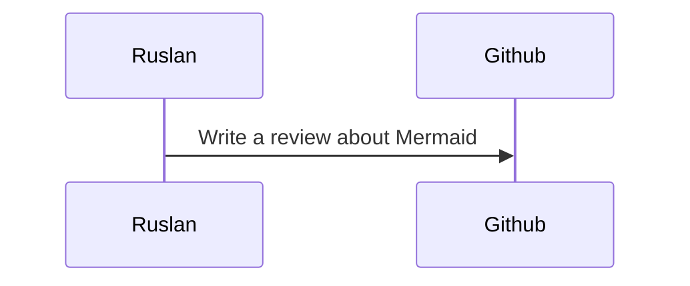

# Ruslan's Awesome List

Welcome to my curated collection of awesomeness! In this list, you'll find a variety of things that I believe are incredibly cool. 
There's no specific order here – everything is equally amazing.

## Table of Contents

- [Software Development](#software-development)
- [Tools](#tools)
- [Awesome lists](#awesome-lists)

## Software Development

### [Boring technologies](https://mcfunley.com/choose-boring-technology)

This article has become a kind of manifesto for me. It's a reminder that innovation is exciting, but when it comes to delivering results in my day-to-day job, 
choosing reliable and 'boring' technologies is often the smarter move. "Want to deliver? Pick boring."

### [The Grug Brained Developer](https://grugbrain.dev)

A humorous yet insightful take on the KISS (Keep It Simple, Stupid) principle. It's something we often talk about in interviews but fail to practice. 
This piece serves as a fun reminder to embrace simplicity in our coding endeavors.

### [3 tribes of programming](https://josephg.com/blog/3-tribes/)

This article breaks down the programmer community into three tribes, each with its own motivations and approaches to coding. 
It's an eye-opener that helped me understand my own journey as a developer and why I prefer 'code beauty' over 'performance'.
Finally, a good reason why my pet projects are not finished 😅.

## Tools 

### [Kotlin](https://kotlinlang.org/)

I enjoy working with Java, and most of my projects are crafted in this language. However, Kotlin holds a special place in my heart, especially during my free time. 
Some might argue that Kotlin is merely Java with a bit of 'sugar', and to an extent, they're right — especially if they believe features like null-safety aren't a big deal. 
But this view changes when considering more than just the code. 
The community surrounding Kotlin and the ongoing developments within it are incredibly fascinating and keep me eagerly checking the 'Trending' section of GitHub each week.

### [Obsidian](https://obsidian.md/)

I have tried way too many note taking apps, ranging from [Bear](https://bear.app/) to [The Brain](https://www.thebrain.com/). 
Over time, my 'knowledge' became fragmented across these various applications, lacking any consistent organization. 
That's when I discovered Obsidian. Its emphasis on linked notes and plain-file philosophy was a game-changer for me. 
While I wouldn't claim to be an expert in using it, I've settled into a comfortable routine with the vanilla version, enhanced by just a few plugins. 
For over five years, I have been using Obsidian, and at no point during that time have I felt the need to switch to another tool.

### [ChatGPT](https://chat.openai.com/)

ChatGPT has almost completely replaced Google for me. It's incredibly useful for studying new topics and clarifying complex concepts in books. 
It has also significantly improved my writing skills and helped me get prepared to IELTS. In fact, even this list was first reviewed by ChatGPT before I posted it. 
While I also use [Bard](https://bard.google.com/) and other models through [Ollama](https://github.com/jmorganca/ollama), ChatGPT stands out as the clear winner in my experience.

### [Pocketbase](https://github.com/pocketbase/pocketbase)

After years of writing backends, I've finally discovered Pocketbase. 
It's a fantastic tool for quickly prototyping any kind of CRUD app without the need to write any code, and it comes with a very neat UI. 
Using Pocketbase, I created [dinf.io](https://dinf.io/), which allowed me to focus solely on developing the frontend.

### [Excalidraw](https://excalidraw.com/)

I've never quite grasped how some people can explain their software ideas using only words. 
For me, the most effective way to communicate concepts is by 'throwing a bunch of rectangles on a whiteboard.'
It is also very crucial when you can do it with fellow developers. To facilitate this, I've recently started using Excalidraw. 
It's extremely user-friendly (I am looking at you draw.io), boasts a pleasing aesthetic, and performs exceptionally well in collaborative settings.

### [Mermaid](https://mermaid.js.org/)

While whiteboarding can be efficient, it's important to have structure and consistency, especially if you plan to share these ideas with others. 
I used to rely on [PlantUML](https://plantuml.com/) for this purpose, which is quite functional, but looks a bit '90-ish'. 
Now, I've switched to Mermaid, which is elegant, has everything I need, and also renders nicely in Markdown:

## Awesome lists

### [Nate's Awesome List](https://github.com/Sintrastes/awesome)

This list was a major inspiration for me to create my own one. It's filled with fascinating articles about software development and functional programming.
